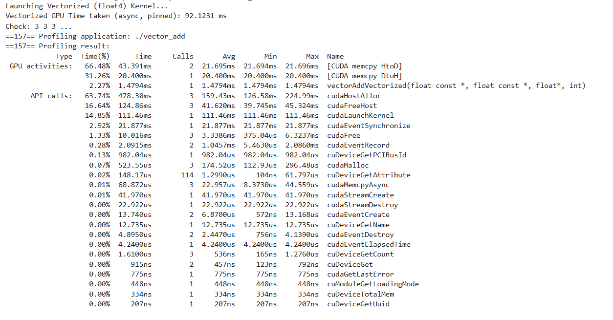

# Bottleneck Explanation - Metrics and Reason

## Pinned Output
 
## What Actually Happens (Physical Reality):

**Time 0ms:** CPU says "GPU, take this 64MB data!"

**Time 0-63ms:** Data SLOWLY traveling on PCIe bus
```
CPU ----[data in bus]----> GPU

GPU: "Waiting for data, not here yet"
GPU cores: IDLE, cannot do anything
```

**Time 63ms:** Complete data reached GPU memory!

**Time 63-64.53ms:** GPU: "Now let's work!"
```
GPU cores: ACTIVE (calculation running)
```

**Time 64.53ms:** Calculation done! Result ready!

**Time 64.53-102.53ms:** Result going back to CPU SLOWLY
```
GPU ----[result in bus]----> CPU

GPU: "Waiting again"
```

**Time 102.53ms:** Done! CPU received result

**Bottleneck means:**
- Data is NOT stuck/blocked
- Data travels at very slow speed (moving slowly)

## Real Example - Your Case:

### Your 16 Million Elements Transfer:

**Pageable memory (SLOW - 1 GB/s):**

- **Time 0ms:** cudaMemcpy() starts
  - OS: "Wait, this memory might be somewhere else"
  - OS: "First lock it, then give to GPU"

- **Time 0-5ms:** OS locking memory (pinning it temporarily)
  - Data: waiting to be locked

- **Time 5-63ms:** Data SLOWLY traveling on PCIe bus
  - [byte 1]...[byte 2]...[byte 3]... (drip drip)
  
- **Why slow?** Pageable memory route is complex:
  - CPU RAM -> OS overhead -> Pin temporarily -> PCIe -> GPU

- **Time 63ms:** GPU: "Finally got it!"

**Pinned memory (FAST - 10 GB/s):**

- **Time 0ms:** cudaMemcpy() starts
  - OS: "This is already locked, transfer directly!"

- **Time 0-7ms:** Data FAST traveling on PCIe bus
  - [chunk 1][chunk 2][chunk 3] (big chunks, fast!)

- **Why fast?** Direct route:
  - CPU RAM (pinned) -> PCIe -> GPU (no OS overhead)

- **Time 7ms:** GPU: "Got it, let's start!"

## Summary:

**Bottleneck means:**
- Data doesn't get stuck
- Data moves slowly
- Thin pipe = water flows slowly
- Thick pipe = water flows fast

**In your case:**
- Pageable memory = thin pipe (1 GB/s) - took 63ms
- Pinned memory = thick pipe (10 GB/s) - will take 7ms
- Same data, same distance, but different pipe width!