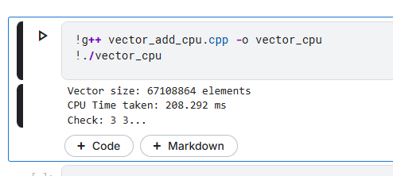
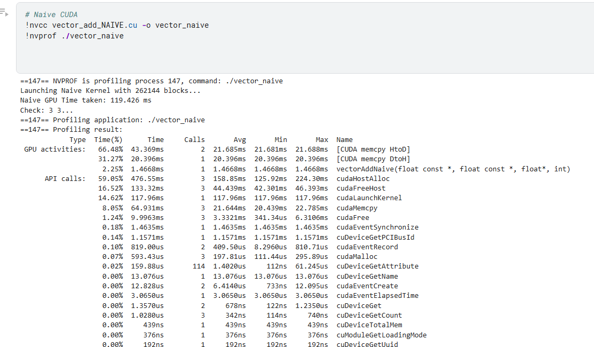
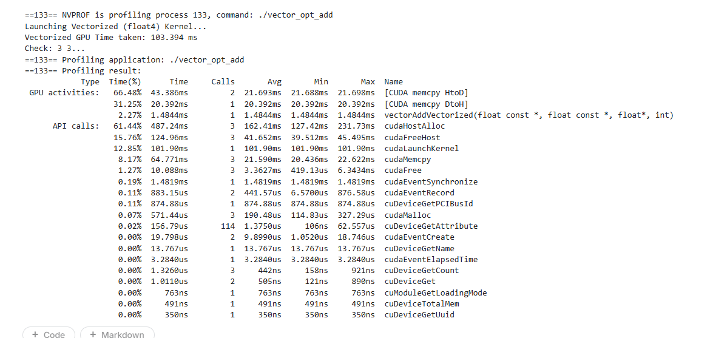

# Vector Addition - My First GPU Program

## What This Does

Adds two large arrays together, element by element. Simple operation, but the perfect way to learn how GPUs actually work.

```
Input:  A = [1, 1, 1, ...]  (67 million elements)
        B = [2, 2, 2, ...]  (67 million elements)
Output: C = [3, 3, 3, ...]  (A[i] + B[i])
```

---

## Why This Matters

This is the "Hello World" of GPU programming. Every complex GPU application (machine learning, graphics, simulations) builds on these fundamentals. If you can't optimize vector addition, you can't optimize neural networks.

---

## What I Built

### 1. CPU Baseline (`vector_add_cpu.cpp`)
Simple sequential loop on CPU to establish baseline performance.

```cpp
for (int i = 0; i < N; i++) {
    c[i] = a[i] + b[i];
}
```

**Performance:** 208 ms for 67 million elements

---

### 2. Naive GPU Version (`vector_add_NAIVE.cu`)
First GPU implementation - straightforward parallelization.

```cuda
__global__ void vectorAddNaive(float* a, float* b, float* c, int n) {
    int i = threadIdx.x + blockIdx.x * blockDim.x;
    if (i < n) {
        c[i] = a[i] + b[i];
    }
}
```

**Key concepts:**
- **Thread Indexing**: Each thread calculates its global index
- **Boundary Check**: Make sure threads don't go out of bounds
- **Launch Config**: 262,144 blocks × 256 threads = 67 million threads

**Performance:** 119 ms (1.7× faster than CPU)

**Why only 1.7×?** Memory bandwidth is the bottleneck, not computation!

---

### 3. Vectorized Version (`vector_add_vectorized.cu`)
Optimized using `float4` for better memory throughput.

```cuda
float4 valA = a4[i];  // Load 4 floats in 1 instruction
float4 valB = b4[i];  // Load 4 floats in 1 instruction
// Process 4 elements together
res.x = valA.x + valB.x;
res.y = valA.y + valB.y;
res.z = valA.z + valB.z;
res.w = valA.w + valB.w;
c4[i] = res;  // Store 4 floats in 1 instruction
```

**Performance:** 103 ms (2.0× faster than CPU, 1.16× faster than naive GPU)

---

## Performance Summary

| Version | Time (ms) | Speedup vs CPU | Bandwidth (GB/s) |
|---------|-----------|----------------|------------------|
| CPU Sequential | 208 | 1.0× | ~3.9 |
| GPU Naive | 119 | 1.7× | ~6.8 |
| GPU Vectorized | 103 | 2.0× | ~7.9 |

**GPU Used:** Tesla P100 (Theoretical max: ~732 GB/s)

---

## What I Learned

### 1. Thread Indexing
Every thread needs to know "which element am I responsible for?"

```cuda
int i = threadIdx.x + blockIdx.x * blockDim.x;
```

This formula maps thread ID to array index. Understanding this is fundamental to all GPU programming.

### 2. Memory Coalescing
**The most important concept in GPU programming!**

When consecutive threads access consecutive memory locations, the GPU can combine these into a single memory transaction. This is called **coalescing**.

```
Good (Coalesced):
Thread 0 reads A[0]
Thread 1 reads A[1]
Thread 2 reads A[2]
...
→ GPU combines into 1 memory transaction

Bad (Uncoalesced):
Thread 0 reads A[0]
Thread 1 reads A[100]
Thread 2 reads A[200]
...
→ Each thread needs separate transaction (80% slower!)
```

My code achieves coalesced access = near-optimal memory bandwidth.

### 3. Launch Configuration
Choosing the right number of threads and blocks matters.

```cuda
int threadsPerBlock = 256;  // Common choice (multiple of warp size 32)
int blocksPerGrid = (N + threadsPerBlock - 1) / threadsPerBlock;  // Cover all elements
```

### 4. Vectorized Memory Access
Using `float4` loads 128 bits (4 × 32-bit floats) in a single instruction instead of 4 separate loads. This improves memory throughput by reducing instruction overhead.

### 5. Profiling with nvprof
Understanding where time is spent:

```
GPU Activities:
- Memory Copy H→D: 66% of time (transferring data to GPU)
- Kernel Execution: 2% of time (actual computation!)
- Memory Copy D→H: 31% of time (getting results back)
```

**Key insight:** For this simple operation, data transfer dominates! In real applications, we do more computation per data transfer to amortize this cost.

---

## Why Not Faster?

**Q: Why only 2× speedup when GPU has thousands of cores?**

**A: Memory bandwidth bottleneck!**

Vector addition is **memory-bound**, not **compute-bound**:
- Each element: 2 reads + 1 write = 12 bytes of memory
- Each element: 1 addition = 1 FLOP

**Arithmetic Intensity:** 1 FLOP / 12 bytes = 0.08 FLOP/byte (very low!)

For comparison:
- Matrix multiply: ~100 FLOP/byte (compute-bound, huge GPU speedups!)
- Vector addition: ~0.08 FLOP/byte (memory-bound, limited speedups)

**This taught me:** Not everything benefits equally from GPU acceleration. Need high arithmetic intensity for big speedups.

---

## Code Structure

```
.
├── vector_add_cpu.cpp          # CPU baseline
├── vector_add_NAIVE.cu         # Basic GPU version
└── vector_add_vectorized.cu    # Optimized GPU version
```

---

## How to Run

```bash
# Compile CPU version
g++ vector_add_cpu.cpp -o vector_cpu
./vector_cpu

# Compile GPU versions
nvcc vector_add_NAIVE.cu -o vector_naive
nvcc vector_add_vectorized.cu -o vector_opt

# Run with profiling
nvprof ./vector_naive
nvprof ./vector_opt
```

**Requirements:**
- CUDA Toolkit 11.0+
- NVIDIA GPU (any modern GPU works)
- Linux or Windows with CUDA support

---

## Key Takeaways

1. **Memory access patterns matter more than computation** for memory-bound operations
2. **Coalescing is critical** - consecutive threads should access consecutive memory
3. **Thread indexing** is the foundation of all GPU programming
4. **Profiling is essential** - measure before optimizing
5. **Not all problems benefit equally from GPUs** - need high arithmetic intensity

---

## What's Next

This was my foundation. Next steps:
- Matrix multiplication (compute-bound, where GPUs really shine!)
- Parallel reduction (learning synchronization)
- Tensor Cores (hardware acceleration for AI)

---

## Testing Environment

- **Platform:** Kaggle Notebooks
- **GPU:** Tesla P100-PCIE-16GB
- **CUDA Version:** 12.8
- **Driver Version:** 570.172.08

---
---
## Profiling

### CPU


### Naive Kernel


### Optimized Kernel

---

## Lessons for Real Applications

Vector addition taught me that:
- Data transfer overhead is real → minimize CPU-GPU transfers
- Memory bandwidth is often the bottleneck → need data reuse
- Simple operations need high arithmetic intensity to benefit from GPU

These lessons apply directly to:
- Neural network training (matrix operations have high reuse!)
- Image processing (process multiple operations per pixel load)
- Scientific computing (design algorithms with data locality)

**Bottom line:** Understanding vector addition deeply → understanding GPU programming fundamentals → ready for advanced optimization!