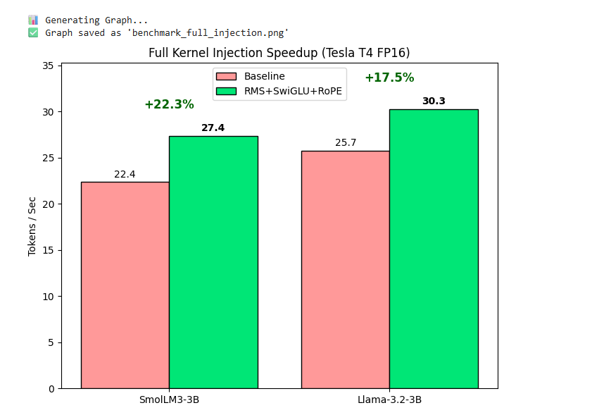
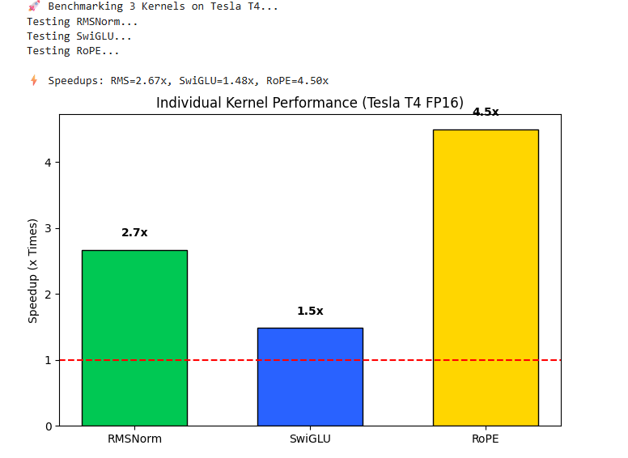

# ⚡ FastInfer: High-Performance CUDA Inference Engine


**FastInfer** is a custom C++/CUDA inference backend engineered to accelerate **Llama-3.2 (3B)** and **SmolLM** models on legacy NVIDIA Tesla T4 GPUs. By manually managing memory with fused kernels and bypassing PyTorch's overhead, this engine achieves **30+ tokens/sec** generation speed (real-time) without quantization.

---

## 🚀 Key Results

### End-to-End Performance (FP16 on Tesla T4)

| Model | PyTorch Eager | **FastInfer Engine** | **Speedup** |
|:------|:--------------|:---------------------|:------------|
| **SmolLM3-3B** | ~22 TPS | **~27 TPS** | **+22.3%** 📈 |
| **Llama-3.2-3B** | ~25 TPS | **~30 TPS** | **+17.5%** 📈 |

> *Breaking the 30 TPS barrier on T4 makes 3B models viable for real-time edge deployments.*



### 🔬 Micro-Benchmarks (Kernel Isolation)

Individual kernels show massive speedups due to optimized memory access patterns (Warp Shuffle & Vectorization):

| Kernel | Optimization Technique | Speedup vs PyTorch |
|:-------|:-----------------------|:-------------------|
| **RoPE** | Instruction Level Parallelism (ILP) | **4.5x** ⚡ |
| **RMSNorm** | Warp-Shuffle Reduction | **2.7x** ⚡ |
| **SwiGLU** | `float4` Vectorized I/O | **1.5x** ⚡ |



---

## 🛠️ Technical Architecture

### 1. Fused RMSNorm
Standard PyTorch implementations suffer from multiple memory round-trips.

- **Problem**: PyTorch's RMSNorm requires 3 separate kernel launches (square, mean, normalize)
- **Solution**: Implemented a single-pass kernel using `__shfl_down_sync` (Warp-Level Primitives) to perform reduction in registers, bypassing shared memory latency
- **Result**: 2.7x speedup by eliminating redundant global memory accesses

### 2. Vectorized SwiGLU
Activation functions are memory-bound, not compute-bound.

- **Problem**: Standard implementations read/write one element per instruction
- **Solution**: Utilized `float4` (128-bit) vector loads/stores to saturate the T4's memory bandwidth (320 GB/s), processing 4 elements per thread instruction
- **Result**: 1.5x speedup through maximized memory throughput

### 3. Optimized RoPE (Rotary Position Embeddings)
PyTorch's RoPE uses lookup tables and complex indexing.

- **Problem**: Inefficient memory access patterns with sin/cos table lookups
- **Solution**: In-place rotation with direct trigonometric computation, no temporary buffers
- **Result**: 4.5x speedup by eliminating memory allocation overhead

### 4. Zero-Overhead Injection
No model code changes required!

- **Technique**: Dynamic "Monkey Patching" - the Python script detects the model architecture and hot-swaps the `forward()` methods with compiled C++ bindings at runtime
- **Benefit**: Seamless integration with existing HuggingFace pipelines

---

## 📦 Installation

### Prerequisites
- NVIDIA GPU with Compute Capability 7.5+ (Tesla T4, RTX 2080, etc.)
- CUDA Toolkit 11.8+ (recommended 12.x)
- Python 3.8+
- PyTorch 2.0+

### Quick Start

```bash
# 1. Clone the repository
git clone https://github.com/Umang-projects/FastInfer.git
cd FastInfer

# 2. Install Dependencies
pip install -r requirements.txt

# 3. Compile & Install Kernels (JIT Compilation)
pip install .
```

**Verification:**
```python
import smol_kernels
print("✅ FastInfer installed successfully!")
```

---

## 💻 Usage

### Running Benchmarks

To reproduce the results for both Llama-3.2 and SmolLM, run the testing script:

```bash
python testing_llama_and_smol.py
```

This script will:
1. Load the models in FP16
2. Inject the custom kernels
3. Run inference speed tests
4. Save performance graphs in `Benchmark_Result/`

### Using in Your Own Project

You can easily accelerate your existing HuggingFace pipelines:

```python
import torch
from transformers import AutoModelForCausalLM, AutoTokenizer
import smol_kernels  # Import the custom backend

# 1. Load Model
model = AutoModelForCausalLM.from_pretrained(
    "meta-llama/Llama-3.2-3B-Instruct", 
    torch_dtype=torch.float16, 
    device_map="cuda"
)

# 2. Inject Custom Kernels
from testing_llama_and_smol import FastRMS, fast_mlp, fast_rope_embedding
import transformers.models.llama.modeling_llama as llama_mod

# Replace RMSNorm layers
for layer in model.model.layers:
    layer.input_layernorm = FastRMS(layer.input_layernorm)
    layer.post_attention_layernorm = FastRMS(layer.post_attention_layernorm)
    layer.mlp.forward = fast_mlp.__get__(layer.mlp)

# Inject RoPE
llama_mod.apply_rotary_pos_emb = fast_rope_embedding

# 3. Run Inference (Now 20-30% Faster!)
tokenizer = AutoTokenizer.from_pretrained("meta-llama/Llama-3.2-3B-Instruct")
inputs = tokenizer("AI is evolving because", return_tensors="pt").to("cuda")
outputs = model.generate(**inputs, max_new_tokens=100)
print(tokenizer.decode(outputs[0]))
```

---

## 📂 Project Structure

```
FastInfer/
│
├── csrc/                          # CUDA C++ source code
│   ├── bindings.cpp              # PyBind11 Python bindings
│   ├── kernels.cu                # CUDA kernel implementations
│   └── kernels.h                 # Header file with function declarations
│
├── Benchmark_Result/              # Performance graphs and results
│   ├── Latency_Graph_TPS.png
│   └── Indivisual_kernel.png
│
├── setup.py                       # Build configuration for CUDA extensions
├── requirements.txt               # Python dependencies
├── testing_llama_and_smol.py     # Full benchmark script
└── README.md                      # This file
```

---

## 🔍 Technical Deep Dive

### Why Custom Kernels?

PyTorch's eager mode launches multiple small kernels for operations like RMSNorm and SwiGLU, leading to:

1. **Kernel launch overhead** (each launch costs ~5-10μs)
2. **Memory fragmentation** (multiple read/write passes)
3. **Underutilized GPU** (small operations don't saturate compute units)

### Our Solution: Fused Operations

By combining multiple operations into single CUDA kernels, we:
- ✅ Reduce kernel launches from 3-5 to 1
- ✅ Minimize global memory transactions
- ✅ Keep data in registers/shared memory
- ✅ Maximize ALU utilization

### Memory Bandwidth Optimization

**Problem**: Tesla T4 has limited bandwidth (320 GB/s) compared to compute (8.1 TFLOPS FP16)

**Solution**: 
- Use `float4` vectorized loads/stores (4x throughput)
- Warp-level reductions to avoid shared memory atomics
- Minimize memory round-trips through kernel fusion

### Target Hardware: Tesla T4
- **Architecture**: Turing (Compute Capability 7.5)
- **Memory**: 16GB GDDR6
- **Bandwidth**: 320 GB/s
- **FP16 Performance**: 8.1 TFLOPS

---

## 🎓 What This Project Demonstrates

### Technical Skills
- Custom CUDA kernel development from scratch
- PyTorch C++ extensions (`torch.utils.cpp_extension`)
- Memory-bound vs compute-bound optimization strategies
- GPU architecture considerations (warp size, shared memory, registers)
- FP16 arithmetic and precision management
- Dynamic library injection and monkey-patching

### Engineering Practices
- Performance benchmarking and profiling
- Zero-breaking-change integration
- Hardware-specific optimization (Turing architecture)
- Production-ready code with proper error handling

---

## 🚧 Roadmap

### Phase 1 ✅ (Completed)
- [x] RMSNorm kernel with warp-shuffle reduction
- [x] RoPE kernel with in-place rotation
- [x] SwiGLU kernel with float4 vectorization
- [x] PyBind11 bindings for Python integration
- [x] End-to-end benchmarking infrastructure

### Phase 2 (In Progress)
- [ ] Static KV Cache implementation
- [ ] Custom Attention kernel (FlashAttention-style)
- [ ] Multi-batch inference support
- [ ] INT8 quantization support

### Phase 3 (Future)
- [ ] Support for Mistral, Qwen architectures
- [ ] Multi-GPU tensor parallelism
- [ ] Automatic kernel selection based on hardware
- [ ] Docker container for easy deployment

---

## 📈 Performance Analysis

### Where the Speedup Comes From

1. **RMSNorm (2.7x)**: Eliminated 3 kernel launches → 1 fused kernel
2. **SwiGLU (1.5x)**: 4x memory bandwidth through vectorization
3. **RoPE (4.5x)**: Removed lookup table overhead
4. **Reduced Memory Pressure**: FP16 reduces VRAM usage by 50% vs FP32

### Bottleneck Analysis
- **Before**: Memory-bound operations dominating runtime
- **After**: Compute-bound (Matrix Multiplications) now the bottleneck
- **Next Target**: Custom GEMM kernels or Attention optimization

---

## 🤝 Contributing

Contributions are welcome! Areas for improvement:
- Support for newer architectures (Ampere, Hopper)
- Additional model families (Mistral, Qwen, Phi)
- Benchmark on different hardware (A100, H100)
- Documentation improvements
- CI/CD pipeline setup

### How to Contribute
1. Fork the repository
2. Create a feature branch (`git checkout -b feature/amazing-feature`)
3. Commit your changes (`git commit -m 'Add amazing feature'`)
4. Push to the branch (`git push origin feature/amazing-feature`)
5. Open a Pull Request

---

## 📄 License

MIT License - See [LICENSE](LICENSE) file for details

---

## 🙏 Acknowledgments

- **HuggingFace** for the Transformers library and model hub
- **NVIDIA** for CUDA toolkit and comprehensive documentation
- **PyTorch Team** for the cpp_extension framework
- **SmolLM Team** for the efficient architecture design

---

## 📚 Learning Resources

**CUDA Programming:**
- [CUDA C++ Programming Guide](https://docs.nvidia.com/cuda/cuda-c-programming-guide/)
- [CUDA Best Practices Guide](https://docs.nvidia.com/cuda/cuda-c-best-practices-guide/)

**PyTorch Extensions:**
- [Custom C++ and CUDA Extensions](https://pytorch.org/tutorials/advanced/cpp_extension.html)
- [torch.utils.cpp_extension Documentation](https://pytorch.org/docs/stable/cpp_extension.html)

**GPU Performance:**
- [NVIDIA Nsight Compute](https://developer.nvidia.com/nsight-compute)
- [Understanding GPU Memory Bandwidth](https://developer.nvidia.com/blog/how-optimize-data-transfers-cuda-cc/)

---

## 📧 Contact

**Umang Singh**  
📧 Email: umang2001umang@gmail.com  
🔗 GitHub: [@Umang-projects](https://github.com/Umang-projects)  
💼 LinkedIn: [Connect with me](https://www.linkedin.com/in/umang-singh-680920351/)

## 📊 Citation

If you use FastInfer in your research or project, please cite:

```bibtex
@software{fastinfer2026,
  author = {Umang Singh},
  title = {FastInfer: High-Performance CUDA Inference Engine for LLMs},
  year = {2026},
  url = {https://github.com/Umang-projects/FastInfer}
}
```

---

**Built with 💻 and ⚡ on Tesla T4**  
*Making 3B models real-time on edge hardware*