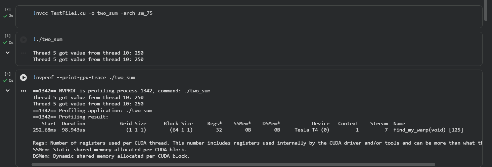

# `kernels/shuffle/README.md`
```markdown
# Warp Shuffle — `shuffle.cu`

## Purpose
Demonstrates warp-level register-to-register communication using shuffle intrinsics (`__shfl_sync`). The example shows how thread 5 reads a value produced by thread 10 inside the same warp — without shared memory or block synchronization.

## Problem statement
A common pattern is that one lane needs a value produced by another lane in the *same warp*. Naive solution uses shared memory + `__syncthreads()` — this adds shared-memory accesses and extra synchronization overhead. For intra-warp communication, shuffle intrinsics are faster and simpler.

## Key idea / solution
- Each lane computes a local value (`my_value`) in a register.
- A receiving lane calls `__shfl_sync(mask, my_value, src_lane)` to read the value that `src_lane` holds in its register.
- This is register-to-register and avoids shared memory and block-wide synchronization.

## Important caveats about correctness and race conditions
- **Compute-before-read:** Ensure the source lane computes/writes its `my_value` before any lane calls `__shfl_sync`. In typical SIMT execution, all lanes in a warp reach the same instruction in lockstep, so as long as the value is computed on each lane *before* the shuffle call, there is no race.
- **Divergence:** If the source lane's computation is inside a divergent branch that the source lane does not execute, the value will not be defined for that lane. Use the `mask` parameter to control participating lanes.
- **Intra-warp only:** Shuffles work only within a warp (32 lanes). Cross-warp communication still requires shared/global memory or multiple steps.
- **Mask usage:** Use a proper mask (e.g., `0xFFFFFFFF`) to mark active lanes; otherwise behavior for inactive lanes is undefined.

