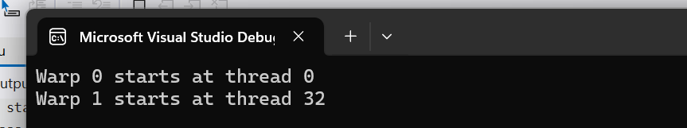

# Warp ID — `warp_id.cu`

## Purpose
Small demonstration showing how threads map to warps and lanes on an NVIDIA GPU. This example helps you reason about warp membership (warp id and lane id), and how to choose a warp leader (commonly lane 0).

## Problem
When writing warp-aware code you often need to:
- identify which warp a thread belongs to, and
- pick a canonical lane in the warp to act as a leader (for printing, aggregation, or coordinating a multi-lane operation).

## Solution
Compute warp and lane from `threadIdx.x`:
```cpp
int tid     = threadIdx.x;
int warp_id = tid / 32;   // warp index inside block (assumes warp size = 32)
int lane_id = tid % 32;   // lane index within warp (0..31)


